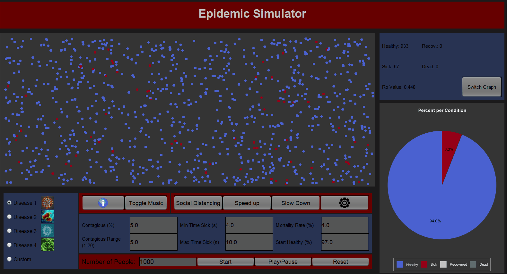
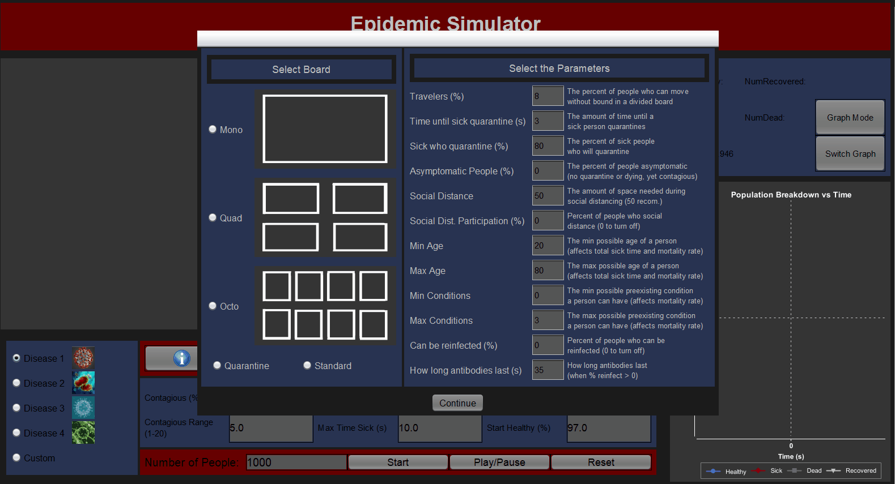

# Epidemic Simulator
A Java application created to model the spread of diseases. Various parameters such as infectivity, asymptomatic carriers, and levels of social distancing can be adjusted by the user.
Link to download the [installer](https://drive.google.com/file/d/1kYLtSxpIpYmeNjdJVcSV9l4wFzby4KG6/view?usp=sharing) for v.1.1

# Motivation and Inspiration
Created during the COVID-19 lockdown of spring 2020 and inspired by Grant Sanderson's of [3Blue1Brown epidemic simulation](https://www.youtube.com/watch?v=gxAaO2rsdIs), this application was created in order to further explore and model the effect of various adjustments to a disease outbreak scenario.

# Features 
- Intuitive and Expansive Design
  - Adjust individual parameters to model various simulation aspects
  - Live graphs and statistics available on a side panel
- Adjustable parameters
  - Number of people
  - Disease lethality and infectivity
  - Single, quad and octo board subdivision
      - Variable percentage of "Roamers" who wander between the subsections
  - Quarantine section
  - Asysmptomatic carriers
- Easy Setup
  - [Download installer](https://drive.google.com/file/d/1vgN2d2q1DNbFu_2qun291vnI9C5xQDp6/view?usp=sharing) (Windows only)
  

# Simple Demo
The application can be configured to represent a rectanglular board for a various number of individuals to inhabit: 

# Board Divisions and Quarantine Demo
The board can be subdivided with the capability of sending a given percentage individuals to the quarantine section:

# Asympotmatic Individuals Demo

# CSV Capabilities
Access to data through an auto-generated CSV file in program folder allows for saving and exporting of any particular simulation.
Data can be imported to any spreadsheet software.

# Frameworks and Libraries used
- Swing
- knowm/XChart https://github.com/knowm/XChart#-xchart
